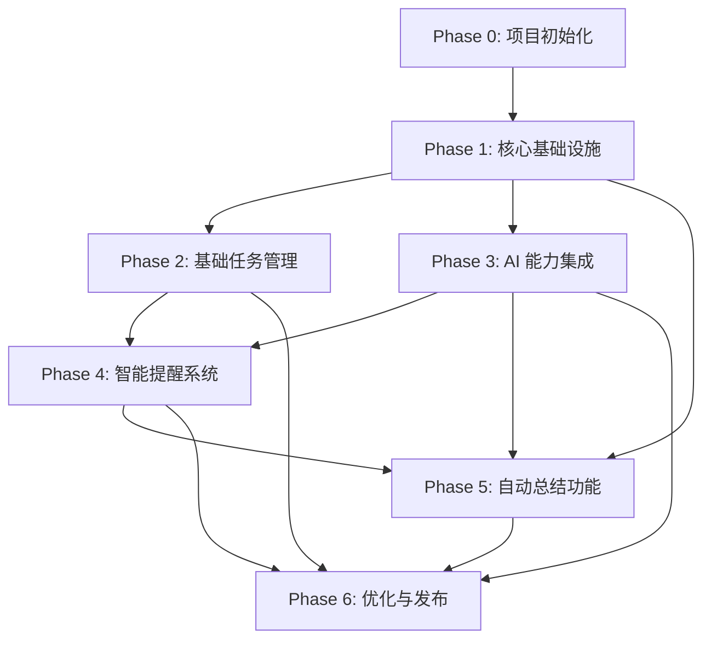

# Intento 开发计划

**项目：** Intento - 智能 Todo 桌面应用
**技术栈：** Rust + Tauri + React + ADK-Rust
**开发模式：** 迭代开发，MVP 优先

---

## 一、开发阶段划分

### Phase 0：项目初始化（1-2 天）
- 搭建项目框架
- 配置开发环境
- 验证技术栈可行性

### Phase 1：核心基础设施（3-5 天）
- 数据库设计与实现
- 基础数据模型
- Tauri 后端架构搭建

### Phase 2：基础任务管理（5-7 天）
- 任务 CRUD 操作
- 前端界面开发
- 状态管理集成

### Phase 3：AI 能力集成（7-10 天）
- AI 客户端封装
- 文本输入解析
- 图片识别功能
- 上下文理解

### Phase 4：智能提醒系统（3-5 天）
- 定时任务调度
- 桌面通知
- 到期提醒逻辑

### Phase 5：自动总结功能（7-10 天）
- 每日总结生成
- 月度总结生成
- 总结档案管理

### Phase 6：优化与发布（5-7 天）
- 性能优化
- 错误处理完善
- 打包与发布

**总计：约 30-45 天（1-1.5 个月）**

---

## 二、详细任务拆分

### Phase 0：项目初始化

#### Task 0.1：创建项目骨架
- **优先级：** P0（必须最先完成）
- **预计时间：** 0.5 天
- **依赖：** 无
- **任务内容：**
  - [ ] 使用 `npm create tauri-app@latest` 创建项目
  - [ ] 选择 React + TypeScript 模板
  - [ ] 验证项目可以正常运行 `npm run tauri dev`
  - [ ] 提交初始代码到 Git
- **验收标准：**
  - 应用可以启动并显示默认界面
  - 前端 React 代码可以热更新
  - Rust 后端可以编译通过

#### Task 0.2：安装前端依赖
- **优先级：** P0
- **预计时间：** 0.5 天
- **依赖：** Task 0.1
- **任务内容：**
  - [ ] 安装 Zustand 状态管理
  - [ ] 初始化 shadcn/ui
  - [ ] 安装常用组件（button, card, dialog, input 等）
  - [ ] 配置 Tailwind CSS
- **验收标准：**
  - shadcn/ui 组件可以正常使用
  - Tailwind 样式生效

#### Task 0.3：配置 Rust 依赖
- **优先级：** P0
- **预计时间：** 1 天
- **依赖：** Task 0.1
- **任务内容：**
  - [ ] 在 `Cargo.toml` 中添加依赖（rusqlite, adk-rust, tokio-cron-scheduler 等）
  - [ ] 验证依赖可以正常编译
  - [ ] 创建基础模块结构（db, ai, commands, scheduler）
- **验收标准：**
  - `cargo build` 编译成功
  - 所有依赖版本无冲突

---

### Phase 1：核心基础设施

#### Task 1.1：设计数据库 Schema ✅
- **优先级：** P0
- **预计时间：** 0.5 天
- **依赖：** Task 0.3
- **状态：** 已完成
- **任务内容：**
  - [x] 设计 `tasks` 表结构
  - [x] 设计 `summaries` 表结构
  - [x] 设计 `context_cache` 表结构
  - [x] 编写 SQL 初始化脚本
- **验收标准：**
  - Schema 文档完整
  - 所有字段类型明确
- **完成说明：**
  - 已创建 `specs/database-schema.md` 文档
  - 已创建 `src-tauri/migrations/v1_initial.sql` 初始化脚本
  - 包含完整的表结构、索引和约束定义

#### Task 1.2：实现数据库初始化模块 ✅
- **优先级：** P0
- **预计时间：** 1 天
- **依赖：** Task 1.1
- **状态：** 已完成
- **任务内容：**
  - [x] 创建 `src-tauri/src/db/mod.rs`
  - [x] 实现数据库连接管理
  - [x] 实现表创建逻辑
  - [x] 实现数据库迁移机制
  - [x] 编写单元测试
- **验收标准：**
  - 应用启动时自动创建数据库文件
  - 表结构正确创建
  - 单元测试通过
- **完成说明：**
  - 已实现基于 rusqlite 的 Database 结构
  - 支持自动读取 migrations/v1_initial.sql 进行初始化
  - 使用 PRAGMA user_version 管理数据库版本
  - 包含数据库创建的单元测试

**代码示例：**
```rust
// src-tauri/src/db/mod.rs
use rusqlite::{Connection, Result};
use std::path::PathBuf;

pub struct Database {
    conn: Connection,
}

impl Database {
    pub fn new(db_path: PathBuf) -> Result<Self> {
        let conn = Connection::open(db_path)?;
        Self::init_tables(&conn)?;
        Ok(Self { conn })
    }

    fn init_tables(conn: &Connection) -> Result<()> {
        conn.execute(
            "CREATE TABLE IF NOT EXISTS tasks (
                id INTEGER PRIMARY KEY AUTOINCREMENT,
                title TEXT NOT NULL,
                description TEXT,
                status TEXT NOT NULL CHECK(status IN ('todo', 'doing', 'done')),
                deadline INTEGER,
                created_at INTEGER NOT NULL,
                updated_at INTEGER NOT NULL,
                context TEXT
            )",
            [],
        )?;
        // ... 其他表
        Ok(())
    }
}
```

#### Task 1.3：实现数据模型（Models） ✅
- **优先级：** P0
- **预计时间：** 1 天
- **依赖：** Task 1.2
- **状态：** 已完成
- **任务内容：**
  - [x] 创建 `Task` 结构体
  - [x] 创建 `Summary` 结构体
  - [x] 创建 `ContextCache` 结构体
  - [x] 实现 Serialize/Deserialize
  - [x] 实现数据验证逻辑
- **验收标准：**
  - 所有模型可以与数据库互转
  - 可以序列化为 JSON 传递给前端
- **完成说明：**
  - 已创建 `src-tauri/src/db/models.rs`
  - 定义了 TaskStatus、Priority、SummaryType、CacheType 枚举
  - 实现了完整的 Task、Summary、ContextCache 结构体
  - 所有类型支持 Serde 序列化/反序列化
  - 包含 from_str/as_str 辅助方法

**代码示例：**
```rust
// src-tauri/src/db/models.rs
use serde::{Deserialize, Serialize};

#[derive(Debug, Serialize, Deserialize, Clone)]
pub struct Task {
    pub id: Option<i64>,
    pub title: String,
    pub description: Option<String>,
    pub status: TaskStatus,
    pub deadline: Option<i64>,
    pub created_at: i64,
    pub updated_at: i64,
    pub context: Option<String>,
}

#[derive(Debug, Serialize, Deserialize, Clone)]
#[serde(rename_all = "lowercase")]
pub enum TaskStatus {
    Todo,
    Doing,
    Done,
}
```

#### Task 1.4：实现任务数据访问层（DAO） ✅
- **优先级：** P0
- **预计时间：** 2 天
- **依赖：** Task 1.3
- **状态：** 已完成
- **任务内容：**
  - [x] 实现 `insert_task` 方法
  - [x] 实现 `update_task` 方法
  - [x] 实现 `delete_task` 方法
  - [x] 实现 `get_task_by_id` 方法
  - [x] 实现 `list_tasks` 方法(支持筛选、排序)
  - [x] 编写集成测试
- **验收标准：**
  - 所有 CRUD 操作正常
  - 边界情况处理正确
  - 集成测试覆盖率 > 80%
- **完成说明：**
  - 已实现完整的 Task CRUD 操作（create_task, get_task, update_task, delete_task）
  - 实现了 list_tasks 支持按 status 筛选
  - 实现了 Summary 相关操作（create_summary, get_summary）
  - 实现了 ContextCache 操作（set_cache, get_cache, clean_expired_cache）
  - 所有方法支持 JSON 字段序列化/反序列化
  - 包含完整的单元测试（test_database_creation, test_task_crud）

---

### Phase 2：基础任务管理

#### Task 2.1：实现任务管理 Tauri Commands
- **优先级：** P0
- **预计时间：** 2 天
- **依赖：** Task 1.4
- **任务内容：**
  - [ ] 创建 `src-tauri/src/commands/task.rs`
  - [ ] 实现 `create_task` command
  - [ ] 实现 `update_task` command
  - [ ] 实现 `delete_task` command
  - [ ] 实现 `get_tasks` command
  - [ ] 在 `main.rs` 中注册 commands
- **验收标准：**
  - 前端可以通过 `invoke` 调用所有命令
  - 错误信息正确返回给前端

**代码示例：**
```rust
// src-tauri/src/commands/task.rs
use crate::db::{Database, models::Task};
use tauri::State;

#[tauri::command]
pub async fn create_task(
    db: State<'_, Database>,
    task: Task,
) -> Result<Task, String> {
    db.insert_task(task)
        .map_err(|e| e.to_string())
}

#[tauri::command]
pub async fn get_tasks(
    db: State<'_, Database>,
    status: Option<String>,
) -> Result<Vec<Task>, String> {
    db.list_tasks(status)
        .map_err(|e| e.to_string())
}
```

#### Task 2.2：创建 Zustand 任务状态管理
- **优先级：** P0
- **预计时间：** 1 天
- **依赖：** Task 2.1
- **任务内容：**
  - [ ] 创建 `src/stores/taskStore.ts`
  - [ ] 定义 Task 接口（与 Rust 模型对应）
  - [ ] 实现 `tasks` 状态
  - [ ] 实现 `addTask`、`updateTask`、`deleteTask` actions
  - [ ] 实现与 Tauri commands 的集成
- **验收标准：**
  - 状态更新触发 UI 重新渲染
  - 与后端数据保持同步

**代码示例：**
```typescript
// src/stores/taskStore.ts
import { create } from 'zustand';
import { invoke } from '@tauri-apps/api/core';

interface Task {
  id?: number;
  title: string;
  description?: string;
  status: 'todo' | 'doing' | 'done';
  deadline?: number;
  created_at: number;
  updated_at: number;
}

interface TaskStore {
  tasks: Task[];
  loading: boolean;
  fetchTasks: () => Promise<void>;
  addTask: (task: Omit<Task, 'id'>) => Promise<void>;
  updateTask: (id: number, updates: Partial<Task>) => Promise<void>;
  deleteTask: (id: number) => Promise<void>;
}

export const useTaskStore = create<TaskStore>((set, get) => ({
  tasks: [],
  loading: false,

  fetchTasks: async () => {
    set({ loading: true });
    try {
      const tasks = await invoke<Task[]>('get_tasks');
      set({ tasks, loading: false });
    } catch (error) {
      console.error('Failed to fetch tasks:', error);
      set({ loading: false });
    }
  },

  addTask: async (task) => {
    const newTask = await invoke<Task>('create_task', { task });
    set((state) => ({ tasks: [...state.tasks, newTask] }));
  },

  updateTask: async (id, updates) => {
    await invoke('update_task', { id, updates });
    set((state) => ({
      tasks: state.tasks.map(t => t.id === id ? { ...t, ...updates } : t)
    }));
  },

  deleteTask: async (id) => {
    await invoke('delete_task', { id });
    set((state) => ({
      tasks: state.tasks.filter(t => t.id !== id)
    }));
  },
}));
```

#### Task 2.3：开发任务列表组件
- **优先级：** P0
- **预计时间：** 2 天
- **依赖：** Task 2.2
- **任务内容：**
  - [ ] 创建 `TaskList.tsx` 组件
  - [ ] 实现任务列表渲染
  - [ ] 实现按状态筛选（Todo/Doing/Done）
  - [ ] 实现任务状态切换
  - [ ] 实现任务删除功能
  - [ ] 使用 shadcn/ui 组件美化界面
- **验收标准：**
  - 任务列表正常显示
  - 筛选功能正常
  - 操作按钮响应正确

#### Task 2.4：开发任务创建/编辑表单
- **优先级：** P0
- **预计时间：** 2 天
- **依赖：** Task 2.2
- **任务内容：**
  - [ ] 创建 `TaskForm.tsx` 组件
  - [ ] 使用 Dialog 实现弹窗表单
  - [ ] 实现标题、描述、截止时间输入
  - [ ] 实现表单验证
  - [ ] 支持创建和编辑两种模式
- **验收标准：**
  - 表单提交后数据正确保存
  - 验证逻辑正确
  - 用户体验流畅

---

### Phase 3：AI 能力集成

#### Task 3.1：封装 ADK-Rust AI 客户端
- **优先级：** P1
- **预计时间：** 2 天
- **依赖：** Task 0.3
- **任务内容：**
  - [ ] 创建 `src-tauri/src/ai/mod.rs`
  - [ ] 实现 AI 客户端初始化
  - [ ] 封装统一的 `parse_input` 接口
  - [ ] 实现错误处理和重试逻辑
  - [ ] 支持从环境变量读取 API Key
  - [ ] 编写单元测试
- **验收标准：**
  - 可以成功调用 OpenAI/Claude API
  - 错误处理健壮
  - 支持切换不同提供商

**代码示例：**
```rust
// src-tauri/src/ai/mod.rs
use adk_model::openai::{OpenAIClient, OpenAIConfig};
use adk_agent::llm::LlmAgentBuilder;
use std::sync::Arc;
use serde::{Deserialize, Serialize};

#[derive(Debug, Serialize, Deserialize)]
pub struct ParsedTask {
    pub title: String,
    pub description: Option<String>,
    pub deadline: Option<String>,
    pub intent: TaskIntent,
}

#[derive(Debug, Serialize, Deserialize)]
pub enum TaskIntent {
    Create,
    Update(i64),  // task_id
    Complete(i64),
}

pub struct AIClient {
    agent: Arc<dyn adk_model::Model>,
}

impl AIClient {
    pub fn new() -> Result<Self, Box<dyn std::error::Error>> {
        let api_key = std::env::var("OPENAI_API_KEY")?;
        let model = OpenAIClient::new(OpenAIConfig::new(api_key, "gpt-4o-mini"))?;

        Ok(Self {
            agent: Arc::new(model),
        })
    }

    pub async fn parse_text_input(
        &self,
        input: &str,
        context: Option<Vec<String>>,
    ) -> Result<ParsedTask, Box<dyn std::error::Error>> {
        let prompt = self.build_parse_prompt(input, context);

        let agent = LlmAgentBuilder::new("task_parser")
            .instruction(&prompt)
            .model(self.agent.clone())
            .build()?;

        let response = agent.run(input).await?;
        let parsed: ParsedTask = serde_json::from_str(&response.content)?;

        Ok(parsed)
    }

    fn build_parse_prompt(&self, input: &str, context: Option<Vec<String>>) -> String {
        let mut prompt = String::from(
            "你是一个任务解析助手。从用户输入中提取：\n\
             1. 任务标题（动作+对象）\n\
             2. 任务描述（可选）\n\
             3. 截止时间（识别如'明天'、'下周一'等）\n\
             4. 用户意图（创建新任务/更新已有任务/标记完成）\n\n\
             返回 JSON 格式：\n\
             {\"title\": \"...\", \"description\": \"...\", \"deadline\": \"2026-02-10\", \"intent\": \"Create\"}\n"
        );

        if let Some(ctx) = context {
            prompt.push_str("\n最近的任务上下文：\n");
            for c in ctx {
                prompt.push_str(&format!("- {}\n", c));
            }
        }

        prompt
    }
}
```

#### Task 3.2：实现文本输入解析 Command
- **优先级：** P1
- **预计时间：** 1 天
- **依赖：** Task 3.1, Task 1.4
- **任务内容：**
  - [ ] 创建 `parse_text_input` command
  - [ ] 从数据库读取最近上下文
  - [ ] 调用 AI 客户端解析
  - [ ] 返回解析结果给前端
- **验收标准：**
  - 能正确识别任务标题
  - 能识别时间表达式
  - 能识别用户意图

**代码示例：**
```rust
#[tauri::command]
pub async fn parse_text_input(
    db: State<'_, Database>,
    ai: State<'_, AIClient>,
    input: String,
) -> Result<ParsedTask, String> {
    // 获取最近的上下文
    let context = db.get_recent_context(5)
        .map_err(|e| e.to_string())?;

    // 调用 AI 解析
    ai.parse_text_input(&input, Some(context))
        .await
        .map_err(|e| e.to_string())
}
```

#### Task 3.3：实现图片识别功能
- **优先级：** P1
- **预计时间：** 2 天
- **依赖：** Task 3.1
- **任务内容：**
  - [ ] 在 AI 客户端中添加 `parse_image` 方法
  - [ ] 使用 gpt-4o 的视觉能力
  - [ ] 创建 `parse_image_input` command
  - [ ] 支持图片路径或 Base64 输入
- **验收标准：**
  - 能从截图中提取文字信息
  - 能识别任务相关内容

**代码示例：**
```rust
impl AIClient {
    pub async fn parse_image_input(
        &self,
        image_path: &str,
    ) -> Result<ParsedTask, Box<dyn std::error::Error>> {
        // 使用 gpt-4o（支持视觉）
        let api_key = std::env::var("OPENAI_API_KEY")?;
        let model = OpenAIClient::new(OpenAIConfig::new(api_key, "gpt-4o"))?;

        let agent = LlmAgentBuilder::new("image_parser")
            .instruction("从图片中提取任务信息，包括标题、描述、截止时间。")
            .model(Arc::new(model))
            .build()?;

        // ADK-Rust 支持图片输入
        let response = agent.run_with_image(image_path).await?;
        let parsed: ParsedTask = serde_json::from_str(&response.content)?;

        Ok(parsed)
    }
}
```

#### Task 3.4：开发任务确认界面
- **优先级：** P1
- **预计时间：** 2 天
- **依赖：** Task 3.2, Task 3.3
- **任务内容：**
  - [ ] 创建 `TaskConfirm.tsx` 组件
  - [ ] 展示 AI 解析结果
  - [ ] 允许用户修改
  - [ ] 实现"确认添加"和"忽略"按钮
  - [ ] 集成到输入流程
- **验收标准：**
  - 解析结果清晰展示
  - 用户可以编辑后确认
  - 操作流畅

#### Task 3.5：实现上下文缓存机制
- **优先级：** P2
- **预计时间：** 1 天
- **依赖：** Task 3.2
- **任务内容：**
  - [ ] 每次解析后保存输入和结果到 `context_cache` 表
  - [ ] 实现上下文清理逻辑（保留最近 N 条）
  - [ ] 在解析时自动读取上下文
- **验收标准：**
  - "刚才那个任务"能正确关联
  - 上下文不会无限增长

---

### Phase 4：智能提醒系统

#### Task 4.1：实现定时任务调度器
- **优先级：** P1
- **预计时间：** 2 天
- **依赖：** Task 0.3
- **任务内容：**
  - [ ] 创建 `src-tauri/src/scheduler/mod.rs`
  - [ ] 使用 tokio-cron-scheduler 初始化调度器
  - [ ] 实现调度器启动/停止逻辑
  - [ ] 在 `main.rs` 中集成调度器
- **验收标准：**
  - 应用启动时自动启动调度器
  - 定时任务可以正常执行

**代码示例：**
```rust
// src-tauri/src/scheduler/mod.rs
use tokio_cron_scheduler::{Job, JobScheduler};
use std::sync::Arc;

pub struct TaskScheduler {
    scheduler: JobScheduler,
}

impl TaskScheduler {
    pub async fn new() -> Result<Self, Box<dyn std::error::Error>> {
        let scheduler = JobScheduler::new().await?;
        Ok(Self { scheduler })
    }

    pub async fn start(&self) -> Result<(), Box<dyn std::error::Error>> {
        self.scheduler.start().await?;
        Ok(())
    }

    pub async fn add_daily_summary_job(&self) -> Result<(), Box<dyn std::error::Error>> {
        let job = Job::new_async("0 0 18 * * *", |_uuid, _l| {
            Box::pin(async {
                println!("生成每日总结...");
                // 调用总结生成逻辑
            })
        })?;

        self.scheduler.add(job).await?;
        Ok(())
    }
}
```

#### Task 4.2：实现到期提醒逻辑
- **优先级：** P1
- **预计时间：** 1 天
- **依赖：** Task 4.1, Task 1.4
- **任务内容：**
  - [ ] 创建定时任务（每小时检查）
  - [ ] 查询即将到期的任务（24 小时内）
  - [ ] 触发桌面通知
- **验收标准：**
  - 任务到期前收到通知
  - 通知内容包含任务标题和截止时间

#### Task 4.3：实现桌面通知
- **优先级：** P1
- **预计时间：** 1 天
- **依赖：** Task 4.2
- **任务内容：**
  - [ ] 使用 Tauri 的通知 API
  - [ ] 创建 `send_notification` command
  - [ ] 实现不同类型的通知（到期、每日回顾）
- **验收标准：**
  - 通知在桌面正常显示
  - 点击通知可以打开应用

**代码示例：**
```rust
use tauri::Manager;

#[tauri::command]
pub async fn send_notification(
    app: tauri::AppHandle,
    title: String,
    body: String,
) -> Result<(), String> {
    app.notification()
        .builder()
        .title(title)
        .body(body)
        .show()
        .map_err(|e| e.to_string())?;

    Ok(())
}
```

#### Task 4.4：实现每日回顾提醒
- **优先级：** P2
- **预计时间：** 1 天
- **依赖：** Task 4.1, Task 4.3
- **任务内容：**
  - [ ] 创建每日 18:00 定时任务
  - [ ] 查询今日未完成任务
  - [ ] 发送桌面通知
  - [ ] 支持用户自定义提醒时间
- **验收标准：**
  - 每天固定时间收到提醒
  - 应用未运行时下次启动补提醒

---

### Phase 5：自动总结功能

#### Task 5.1：实现每日总结生成
- **优先级：** P1
- **预计时间：** 3 天
- **依赖：** Task 4.1, Task 3.1, Task 1.4
- **任务内容：**
  - [ ] 创建 `generate_daily_summary` 函数
  - [ ] 查询今日所有任务
  - [ ] 调用 AI 生成自然语言总结
  - [ ] 保存到 `summaries` 表
  - [ ] 创建定时任务（每天 23:00）
  - [ ] 实现补生成逻辑（离线时）
- **验收标准：**
  - 每天自动生成总结
  - 总结内容包含完成/进行中/风险任务
  - 离线期间的总结能补生成

**代码示例：**
```rust
pub async fn generate_daily_summary(
    db: &Database,
    ai: &AIClient,
    date: &str,
) -> Result<String, Box<dyn std::error::Error>> {
    // 查询今日任务
    let tasks = db.get_tasks_by_date(date)?;

    // 构建 Prompt
    let prompt = format!(
        "请总结以下任务的完成情况，生成一段自然语言总结：\n\
         完成的任务：{}\n\
         进行中的任务：{}\n\
         新增的任务：{}\n\
         风险任务：{}",
        format_tasks(&tasks.completed),
        format_tasks(&tasks.doing),
        format_tasks(&tasks.new),
        format_tasks(&tasks.overdue),
    );

    // 调用 AI
    let summary = ai.generate_summary(&prompt).await?;

    // 保存到数据库
    db.insert_summary("daily", date, &summary)?;

    Ok(summary)
}
```

#### Task 5.2：实现月度总结生成
- **优先级：** P1
- **预计时间：** 2 天
- **依赖：** Task 5.1
- **任务内容：**
  - [ ] 创建 `generate_monthly_summary` 函数
  - [ ] 查询本月所有任务
  - [ ] 按主题自动聚合
  - [ ] 调用 AI 生成月度总结
  - [ ] 创建定时任务（每月 1 日）
- **验收标准：**
  - 每月自动生成总结
  - 总结包含关键事件和趋势

#### Task 5.3：实现季度和年度总结
- **优先级：** P2
- **预计时间：** 2 天
- **依赖：** Task 5.2
- **任务内容：**
  - [ ] 创建 `generate_quarterly_summary` 函数
  - [ ] 创建 `generate_yearly_summary` 函数
  - [ ] 分析工作节奏和产出变化
  - [ ] 创建对应定时任务
- **验收标准：**
  - 季度和年度自动生成总结
  - 总结有数据分析和可视化

#### Task 5.4：开发总结中心界面
- **优先级：** P1
- **预计时间：** 3 天
- **依赖：** Task 5.1, Task 5.2
- **任务内容：**
  - [ ] 创建 `SummaryCenter.tsx` 组件
  - [ ] 实现时间轴展示
  - [ ] 支持按类型筛选（日/月/季/年）
  - [ ] 实现总结详情查看
  - [ ] 支持手动重新生成总结
- **验收标准：**
  - 时间轴清晰展示
  - 总结内容格式化显示
  - 导航流畅

---

### Phase 6：优化与发布

#### Task 6.1：性能优化
- **优先级：** P2
- **预计时间：** 2 天
- **依赖：** 所有核心功能完成
- **任务内容：**
  - [ ] 数据库查询优化（添加索引）
  - [ ] 前端列表虚拟滚动（大量任务时）
  - [ ] AI 调用结果缓存
  - [ ] 减少不必要的重新渲染
- **验收标准：**
  - 列表滚动流畅（1000+ 任务）
  - AI 调用响应时间 < 3 秒

#### Task 6.2：错误处理完善
- **优先级：** P1
- **预计时间：** 2 天
- **依赖：** 所有核心功能完成
- **任务内容：**
  - [ ] 统一错误类型定义
  - [ ] 前端错误边界（Error Boundary）
  - [ ] 网络错误重试机制
  - [ ] 友好的错误提示
  - [ ] 日志记录
- **验收标准：**
  - 所有错误有友好提示
  - 应用不会因错误崩溃

#### Task 6.3：用户设置功能
- **优先级：** P2
- **预计时间：** 2 天
- **依赖：** Task 4.4
- **任务内容：**
  - [ ] 创建设置页面
  - [ ] 支持配置 AI 提供商和 API Key
  - [ ] 支持配置提醒时间
  - [ ] 支持配置主题（深色/浅色模式）
  - [ ] 设置持久化保存
- **验收标准：**
  - 设置修改后立即生效
  - 重启应用设置保留

#### Task 6.4：打包与发布
- **优先级：** P1
- **预计时间：** 2 天
- **依赖：** 所有功能完成
- **任务内容：**
  - [ ] 配置应用图标
  - [ ] 配置打包参数
  - [ ] 生成 macOS .app/.dmg
  - [ ] 生成 Windows .exe/.msi
  - [ ] 编写 README 和使用文档
  - [ ] 发布到 GitHub Releases
- **验收标准：**
  - 安装包可以正常安装
  - 应用在目标平台正常运行

---

## 三、任务依赖关系图



**关键路径：**
Phase 0 → Phase 1 → Phase 2 → Phase 3 → Phase 5 → Phase 6

---

## 四、优先级说明

### P0（最高优先级，MVP 必须）
- 项目初始化
- 数据库基础设施
- 基础任务 CRUD
- AI 文本解析
- 任务确认界面

### P1（高优先级，完整功能必须）
- AI 图片识别
- 定时提醒
- 每日总结
- 月度总结
- 总结中心

### P2（中优先级，体验优化）
- 上下文缓存
- 每日回顾提醒
- 季度/年度总结
- 性能优化
- 用户设置

---

## 五、里程碑（Milestones）

### Milestone 1：可用的任务管理器（Week 2）
- 完成 Phase 0, 1, 2
- 验收：可以手动创建、编辑、删除任务

### Milestone 2：AI 智能解析（Week 3）
- 完成 Phase 3
- 验收：可以通过文字和图片智能创建任务

### Milestone 3：完整的智能助手（Week 5）
- 完成 Phase 4, 5
- 验收：具备提醒和自动总结功能

### Milestone 4：发布版本（Week 6-7）
- 完成 Phase 6
- 验收：可以打包发布给用户使用

---

## 六、开发建议

### 1. 迭代开发策略
- 每个 Phase 完成后进行验收
- 优先完成 P0 任务，确保 MVP 可用
- 使用 Git 分支管理（feature/task-xxx）

### 2. 测试策略
- 单元测试：Rust 核心逻辑（DAO、AI 客户端）
- 集成测试：Tauri Commands
- 手动测试：前端 UI 和交互

### 3. 文档维护
- 代码注释（复杂逻辑）
- API 文档（Tauri Commands）
- 用户使用文档

### 4. 风险控制
- **AI API 成本**：开发阶段使用 gpt-4o-mini 降低成本
- **依赖版本冲突**：锁定依赖版本，使用 Cargo.lock
- **跨平台兼容性**：尽早在多平台测试

---

## 七、开发环境配置清单

### 必需工具
- [ ] Rust 1.75+
- [ ] Node.js 18+
- [ ] Tauri CLI
- [ ] Git

### 可选工具
- [ ] Rust Analyzer（VSCode 插件）
- [ ] ESLint + Prettier（前端代码格式化）
- [ ] SQLite Viewer（数据库查看）

### 环境变量配置
```bash
# .env
OPENAI_API_KEY=sk-xxx
ANTHROPIC_API_KEY=sk-ant-xxx
```

---

## 八、下一步行动

**当前状态：Phase 1 基本完成（80%），准备进入 Phase 2**

**立即开始：**
1. 执行 Task 2.1：实现任务管理 Tauri Commands
   - 创建 `src-tauri/src/commands/task.rs`
   - 实现 create_task, update_task, delete_task, get_tasks commands
   - 在 main.rs 中初始化数据库并注册 commands
2. 执行 Task 2.2：创建 Zustand 任务状态管理
   - 创建 `src/stores/taskStore.ts`
   - 定义前端 Task 接口
   - 实现与 Tauri 的集成
3. 执行 Task 2.3：开发任务列表组件
   - 验证前后端通信
   - 实现基础的任务显示功能

**本周目标（2026-02-10 至 2026-02-16）：**
完成 Phase 2：基础任务管理，实现一个可以手动创建、编辑、删除任务的 MVP。

**已完成的 Phase 1 任务：**
- ✅ Task 1.1: 设计数据库 Schema
- ✅ Task 1.2: 实现数据库初始化模块
- ✅ Task 1.3: 实现数据模型（Models）
- ✅ Task 1.4: 实现任务数据访问层（DAO）

---

---

**文档版本：** V1.1
**最后更新：** 2026-02-09

---

## 九、开发进度跟踪

### 当前阶段：Phase 1 - 核心基础设施 ✅ 完成！

**已完成的任务：**

#### Phase 1: 核心基础设施（已完成 100%）
- ✅ Task 1.1: 设计数据库 Schema
  - 完成时间：2026-02-09
  - 产出：`specs/database-schema.md`, `src-tauri/migrations/v1_initial.sql`

- ✅ Task 1.2: 实现数据库初始化模块
  - 完成时间：2026-02-09
  - 产出：`src-tauri/src/db/mod.rs` 核心数据库模块
  - 特性：自动初始化、迁移机制、版本管理

- ✅ Task 1.3: 实现数据模型（Models）
  - 完成时间：2026-02-09
  - 产出：`src-tauri/src/db/models.rs`
  - 包含：Task, Summary, ContextCache 及相关枚举类型

- ✅ Task 1.4: 实现任务数据访问层（DAO）
  - 完成时间：2026-02-09
  - 产出：完整的数据库 CRUD 操作
  - 覆盖：任务管理、总结管理、缓存管理
  - 测试：包含单元测试和集成测试

- ✅ Task 1.5: 创建 Tauri Commands
  - 完成时间：2026-02-09
  - 产出：`src-tauri/src/commands/` 目录
  - Commands：create_task, get_task, update_task, delete_task, list_tasks, get_db_version

- ✅ Task 1.6: 集成到 main.rs
  - 完成时间：2026-02-09
  - 优化：Database 实现 Clone，避免双重锁定
  - 集成：在 setup 中初始化数据库，注册所有 commands

- ✅ Task 1.7: 功能验证
  - 完成时间：2026-02-09
  - 产出：测试界面 `src/App.tsx`
  - 验证：编译通过、单元测试通过、应用启动成功、前后端通信正常

**进行中的任务：**
- 无

**整体进度：**
- Phase 0: 项目初始化 - ✅ 100% 完成
- Phase 1: 核心基础设施 - ✅ 100% 完成
- Phase 2: 基础任务管理 - 待开始
- Phase 3: AI 能力集成 - 待开始
- Phase 4: 智能提醒系统 - 待开始
- Phase 5: 自动总结功能 - 待开始
- Phase 6: 优化与发布 - 待开始

**下一步计划：**
1. 开始 Phase 2: 基础任务管理
2. 任务优先级：Task 2.2 创建 Zustand 状态管理（跳过 2.1，因为 Commands 已完成）
3. 继续任务：Task 2.3 开发任务列表组件

**技术债务/待优化项：**
- 无

**遇到的问题和解决方案：**
- ✅ 解决：双重锁定问题（Mutex<Database> 而 Database 内部有 Arc<Mutex>）
  - 方案：让 Database 实现 Clone，直接使用 Database 而不是 Mutex<Database>
